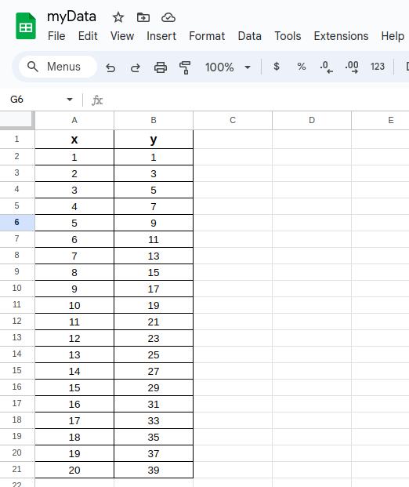
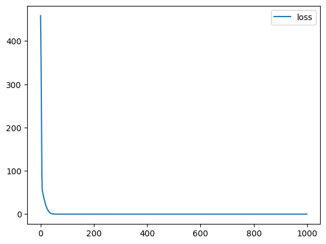
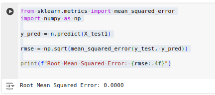
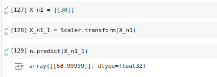

# Developing a Neural Network Regression Model

## AIM

To develop a neural network regression model for the given dataset.

## THEORY

In the context of developing a neural network regression model for a given dataset, the theoretical framework entails the optimization of a multi-layered architecture wherein the objective function, typically a loss function such as mean squared error, is minimized through gradient-based methods. This involves the utilization of backpropagation algorithms to update synaptic weights iteratively, thereby facilitating the model's capacity to approximate continuous-valued outputs with high fidelity. The efficacy of the model is contingent upon the meticulous selection of hyperparameters, regularization techniques, and the architecture's depth and breadth, all of which contribute to mitigating overfitting and enhancing generalization performance.

## Neural Network Model


## DESIGN STEPS

### STEP 1:

Loading the dataset

### STEP 2:

Split the dataset into training and testing

### STEP 3:

Create MinMaxScalar objects ,fit the model and transform the data.

### STEP 4:

Build the Neural Network Model and compile the model.

### STEP 5:

Train the model with the training data.

### STEP 6:

Plot the performance plot

### STEP 7:

Evaluate the model with the testing data.

## PROGRAM
### Name: Sam Israel D
### Register Number: 212222230128
##### Import necessary packages
```python
import pandas as pd
from sklearn.model_selection import train_test_split
from sklearn.preprocessing import MinMaxScaler
from tensorflow import keras
from keras import models
from keras import layers

from google.colab import auth
import gspread
from google.auth import default
```
##### Google authentication
```python
auth.authenticate_user()
creds, _ = default()
gc = gspread.authorize(creds)
```
##### Read data
```python
worksheet = gc.open('myData').sheet1
data = worksheet.get_all_values()
dataset1 = pd.DataFrame(data[1:], columns=data[0])
```
##### Set targets and labels
```python
X = dataset1[['x']].values
y = dataset1[['y']].values

X = X.astype(float)
y = y.astype(float)
```
##### Define training and testing varibales
```python
X_train,X_test,y_train,y_test = train_test_split(X,y,test_size = 0.33,random_state = 33)
```
##### Normalize the dataset
```python
Scaler = MinMaxScaler()
Scaler.fit(X_train)

X_train1 = Scaler.transform(X_train)
```
##### Build and train the model
```python
n = models.Sequential([
    keras.Input(shape = (1,)),
    keras.layers.Dense(units = 3),
    keras.layers.Dense(units = 1)
])
n.compile(optimizer='sgd', loss='mean_squared_error')
n.fit(X_train1 , y_train , epochs = 1000)
```
##### Visualize Training Loss
```python
loss = pd.DataFrame(n.history.history)

loss.plot()
```
##### Make predictions
```python
X_test1 = Scaler.transform(X_test)

n.evaluate(X_test1,y_test)

X_n1 = [[30]]
X_n1_1 = Scaler.transform(X_n1)
n.predict(X_n1_1)
```
##### Calculate RMSE
```python
from sklearn.metrics import mean_squared_error
import numpy as np

y_pred = n.predict(X_test1)

rmse = np.sqrt(mean_squared_error(y_test, y_pred))

print(f"Root Mean Squared Error: {rmse:.4f}")
```
## Dataset Information

## OUTPUT

### Training Loss Vs Iteration Plot



### Test Data Root Mean Squared Error



### New Sample Data Prediction


## RESULT

Thus, a neural network regression model is successfully prepared for the given dataset.
